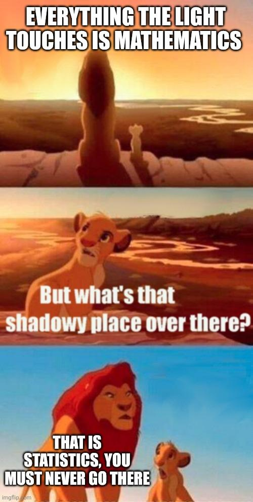

# Consistent hashing math

This is a derivation of the formulas that describe the distribution of work in systems using consistent hashing to share work. It is part technical paper, part demo and part blog post, so there is a lot of math, some web assembly, but also some jokes. My hope is that it will be complete and compelling but also approachable (and interesting?) for any reader regardless of background.

This is a companion piece to [this blog post](todo) I wrote for Cloudflare, so check it out if you want to hear the complete story and how we used the math here to safely reclaim 100+ TB of RAM on the edge. It also has a basic primer on what consistent hashing even is.

## Motivation

The main reason I'm writing this is to help out anyone in the future who is interested in this subject. When I first started researching the subject of consistent hashing and how its accuracy changes based on the number of hashes, I was frustrated by the resources that came up when googling. The results ranged from detailed (but utterly opaque to me) technical papers on the subject or understandable but incomplete derivations from online computer science class resources.

The payoff in both of these cases is an upper bound on the error in how evenly tasks are distributed with consistent hashing given in terms of asymptotic, "Big-O" limits

$$
    \mathcal{O}\left( \sqrt{\frac{1}{k}} \right)
$$

where $k$ is the number of hashes per server. It's not clear how closely the actual error matches that limit, so I set out to derive the actual formula and find out for myself. What I found was that all you need to solve this problem analytically is some high-school math and a little creativity.

## TLDR

If you are here for a quick answer, I won't make you wait. The formula for consistent-hashing error for $N$ servers with $k$ hashes each is

$$
    \text{Err}_k = \sqrt{\frac{N-1}{kN+1}}
$$

Which _is_ very close to $ \sqrt{\frac{1}{k}}$ if $N$ is large. In a system where the number of servers is 50 or more, the difference between the actual error value and the approximation is ~1%. It's a useful approximation, but without seeing what went into it, it's impossible to see what its other implications are. For instance, how do things change if each server has a _different_ number of hashes? We will answer that question and more, so now let's prove it!

## Part 1 - Single hashes

In order to get to the above equation, we need to start with a simpler entry point. When we use consistent hashing in practice, we operate on integers (normally 32 or 64-bit). This makes computations easier and faster as well as giving us access to well-behaved hash functions, but for our purposes it's going to be easier to consider hashes as real numbers between zero and 1 instead of a bounded range of integers.

Unfortunately, this does mean that the result I've already stated above is _also_ an approximation (and thus I have [already lied to you](https://x.com/ThePrimeagen/status/1861040630832742795)), but as you will see, this is a good approximation as long as your number of hashes and servers is not _too_ big.

### Baby Steps

Let's ease our way in and start with something small. Let's say we have a single server with a single hash that's part of a consistent hash setup with at least 1 more server. How do we determine the distribution for the workload that our server will handle? One easy way to think about this is geometrically. Recall from above that we are remapping the integer hash space to real numbers between 0 and 1; in this representation, the fraction of the work handled by our server is the same as the length of the segment assigned to it (Assuming the hashes of the tasks have a uniform distribution). Below is an interactive demo showing how the size of the region associated with our server can vary compared to the average size.

    

        <label for="total_hashes">Total Hashes</label>
        <input name="total_hashes" type="range" min="2" max="1000" value="20" step = 1 oninput="this.nextElementSibling.value = this.value">
        <output for="total_hashes">20</output>
    

    <button>Rerun</button>
    

The error percentage shows how far off from the expected size our server's region is.

$$
    \frac{L - 1/H}{1/H}
$$

where $H$ is the total number of hashes.

After rerunning a few times you can see that the size of the region associated with our server varies _wildly_ and that variation does not seem to depend on the total number of hashes. We'll see why that is in a moment.

### Loop unrolling

One important thing to notice that I've glossed over so far is that the region between the first and last hash is connected making the hash domain effectively a ✨circle✨. That's why most posts about consistent hashing feature a graphic like the one below showing the angular ranges assigned to each server as a different color.

Looking at the ranges like this reinforces a fact we have already used. The absolute positions for the hashes for the servers do not matter. It's only their positions relative to each other that affect the distribution. In other words, there are no "special" points in the hash output, so we can choose our "zero" point to be anywhere. Setting zero to be equal to one of the hashes has the nice property that we no longer have to consider circular aspect of the hash ring.

Naturally the best point to choose to be our "zero" for simplicity is the hash associated with _our_ server.

    

        <label for="total_hashes">Total Hashes</label>
        <input name="total_hashes" type="range" min="2" max="1000" value="20" step = 1 oninput="this.nextElementSibling.value = this.value">
        <output for="total_hashes">20</output>
    

    <button>Rerun</button>
    

This reorientation of the hash space means that the length of the segment associated with our server is only determined by the minimum of all other hashes.

$$
    L = min\left\{ h_2, h_3, ..., h_H \right\}
$$

_This_ is something we can calculate a statistical distribution for.

### A little statistics

Statistics was the only class in college that I got a C in (Maybe I would have gone to class if it wasn't at 8am), so I don't feel like I have any right to lecture anyone on it ... but I'm going to anyway.

Ultimately we would like to be able to get the mean and standard deviation for the length of the segment associated with our server, and those are defined in terms of the [probability-density function (PDF)](https://en.wikipedia.org/wiki/Probability_density_function) for the length of the first segment. In order to get to the PDF we will start by first deriving its [cumulative-distribution function (CDF)](https://en.wikipedia.org/wiki/Cumulative_distribution_function).

Consider a point $x$ somewhere on our number line from 0 to 1. The CDF for the length of our segment is the probability that the length is $\le x$. That probability is the same as the probability that the length is _not_ $> x$ which is

$$
    P \left( L \le x \right) = 1 - P \left( L > x \right)
$$

This is true because $P \left( L \le x \right)$ and $P \left( L > x \right)$ are ["complementary events"](https://en.wikipedia.org/wiki/Complementary_event) which is just a fancy way of saying that one or the other is always true, but never both. We make this change because $P \left( L > x \right)$ is the the same as probability that all the hashes $\left\{ h_2, h_3, ..., h_H\right\}$ are $\ge x$. Since each hash is [independent](https://en.wikipedia.org/wiki/Independence_(probability_theory)) (meaning the value of one hash doesn't affect any other), we can say this probability of all being true is the product of the probability of each being independently true.

$$
    \begin{align*}
    P \left(L \ge x\right) &= P\left( \left\{ h_2, h_3, ... h_H \right\} > x\right) \\
        &= \underbrace{
            P\left(h_2 > x\right) \times
            P\left(h_3 > x\right) \times ... \times
            P\left(h_H > x\right)  }_{H-1\text{ Terms}}\\
    \end{align*}
$$

Determining the probability that an individual hash is $> x$ is simply $1 - x$. We could prove this by integrating the [PDF](https://en.wikipedia.org/wiki/Probability_density_function) of the uniform distribution, but that's a bit boring (and we'll end up doing that later). Instead, here is another interactive demo that calculates the probability empirically via simulation.

    

        <label for="x"><math xmlns="http://www.w3.org/1998/Math/MathML"><semantics><mrow><mi>x</mi></mrow><annotation encoding="application/x-tex">x</annotation></semantics></math>x</label>
        <input name="x" type="range" min="0" max="100" value="20" oninput="this.nextElementSibling.value = this.value / 100">
        <output for="x">0.2</output>
    

    

        <label for="total_hashes">Total Hashes</label>
        <input name="total_hashes" type="range" min="0" max="16" value="6" oninput="this.nextElementSibling.value = 1 << this.value">
        <output for="total_hashes">64</output>
    

    <button>Rerun</button>
    

So now that we know $P \left(h_i > x\right) = 1 - x$ and we know that that probability is the same for every hash, we can put everything together to get the CDF for the length of our segment $L$.

$$
    \begin{align*}
    \text{CDF}\left(L\right) &= P \left(L \le x\right) \\
        &= 1 - P \left(L > x\right) \\
        &= 1 -  P\left(h_2 > x\right) \times
            P\left(h_3 > x\right) \times ... \times
            P\left(h_H > x\right) \\
        &= 1 - P\left(h > x\right)^{H-1} \\
        &= \boxed{1 - \left(1 - x\right)^{H - 1}}
    \end{align*}
$$

### A little calculus 😅

Getting from CDF to PDF is a matter of differentiating the CDF by $x$. So buckle up, this is where the calculus starts. Here we just need to use the [distributive property](https://en.wikipedia.org/wiki/Linearity_of_differentiation) and the [power rule](https://en.wikipedia.org/wiki/Power_rule).

$$
    \begin{align*}
    \text{PDF} \left(L\right)
        &= \frac{d}{dx}\text{CDF} \left( x \right) \\
        &= \frac{d}{dx}\left( 1 - \left(1 - x\right)^{H - 1} \right) \\
        &= \frac{d}{dx}\left( 1 \right) - \frac{d}{dx}\left(1 - x\right)^{H - 1} \\
        &= 0 - \left(-\left( H - 1 \right)\right)\left(1-x\right)^{H-2} \\
        &= \boxed{\left(H - 1 \right)\left(1-x\right)^{H-2}}
    \end{align*}
$$

Which if we plot, looks like this.

    

        <label for="total_hashes">Total Hashes</label>
        <input name="total_hashes" type="range" min="1" max="16" value="7" oninput="this.nextElementSibling.value = 1 << this.value">
        <output for="total_hashes">128</output>
    

    <input type="hidden" name="histogram_bins" value="7">
    <input type="hidden" name="sample_count" value="100">
    <input type="hidden" name="title" value="Single-Hash Segment Length - PDF">
    <input type="hidden" name="actual_pdf" value="true">
    

### Reality vs probability

Let's pause for a second before we use the PDF above to calculate the expected value and standard deviation to bring things back to reality. As you might have noticed, the PDF has values _above_ 1. This should be a good clue that the PDF does _not_ give you a way to look up the probability of a specific value ... so then like what good is it? ... and how do you find out the probability of a specific value?

The answer to both of those questions is **histograms**. As an answer to a purely mathematical problem it's maybe a little unsatisfying. Histogram are exceedingly practical tools that we typically use when measuring or visualizing things in the real world like latency or dB levels. The reason they come up here is because of the simplification we made at the very beginning. Our CDF and PDF above are based on the continuous range between 0 and 1 instead of the discrete length that will actually appear in our hash output. That simplification means that each specific length has infinite precision and therefor an infinitesimal probability by its self. In order to get an appreciable/useful value for probability, we have to look at the probability within a specific range of lengths. Plotting the probability between a bunch of different ranges is essentially the definition of a histogram, and the way we calculate the probability in that range is with the PDF (or CDF).

$$
    \begin{align*}
    P\left(x_{min} < x \le x_{max}\right)
        &= \int_{x_{min}}^{x_{max}}\text{PDF}(x)dx \\
        &= \text{CDF}\left(x_{max}\right) - \text{CDF}\left(x_{min}\right)
    \end{align*}
$$

Using that definition we can create a new plot based on the derived PDF that shows the probability of a single-segment length with a variable histogram resolution.

    

        <label for="total_hashes">Total Hashes</label>
        <input name="total_hashes" type="range" min="1" max="16" value="7" oninput="this.nextElementSibling.value = 1 << this.value">
        <output for="total_hashes">128</output>
    

    

        <label for="histogram_bins">Histogram Bins</label>
        <input name="histogram_bins" type="range" min="1" max="10" value="4" oninput="this.nextElementSibling.value = 1 << this.value">
        <output for="histogram_bins">16</output>
    

    <input type="hidden" name="sample_count" value="100">
    <input type="hidden" name="title" value="Single-Hash Segment Length - Histogram">
    

Notice the plot still follows the same shape as the pdf. This makes sense since the expression $\text{CDF}\left(x_{max}\right) - \text{CDF}\left(x_{min}\right)$ is just a scaled approximation of the PDF at $x$. Calculating the probability of our single segment having a value within a discrete range has the advantage that we can now compare our calculated distribution to some <del>real-world</del> simulated results. Is this necessary? No ... math is math ... but sometimes its helpful to prove to yourself that _your_ math is the right math.

Below is an interactive demo that allows you to simulate a bunch of single-segment lengths and compare the empirical distribution with the derived one for a given number of hashes.

    

        <label for="total_hashes">Total Hashes</label>
        <input name="total_hashes" type="range" min="1" max="16" value="8" oninput="this.nextElementSibling.value = 1 << this.value">
        <output for="total_hashes">256</output>
    

    

        <label for="histogram_bins">Histogram Bins</label>
        <input name="histogram_bins" type="range" min="1" max="10" value="4" oninput="this.nextElementSibling.value = 1 << this.value">
        <output for="histogram_bins">16</output>
    

    

        <label for="sample_count">Sample Count</label>
        <input name="sample_count" type="range" min="1" max="16" value="10" oninput="this.nextElementSibling.value = 1 << this.value">
        <output for="sample_count">1024</output>
    

    <input type="hidden" name="title" value="Single-Hash Segment - Reality vs Theory">
    <input type="hidden" name="run_simulation" value="true">
    <button>Rerun</button>
    

Excellent! After playing around with the possible values in the experiment above, it should be possible to convince yourself that our math does in fact math. Let's finish off this section by calculating the mean and standard deviation for the single-hash setup.

### Single-hash distribution finale

We'll make this quick since we still have a long way to go. To get the expected value and standard deviation for the single-hash distribution, we can apply the definitions directly based on the PDF we derived above.

The expected value for the length of a single hash segment when there are $H$ total hashes is:

$$
    \begin{align*}
        \text{Exp}\left(L\right)
            &= \int{x\cdot\text{PDF}(x)dx} \\
            &= \int_0^1{x \left( H - 1 \right)\left(1 - x\right)^{H-2}dx} \\
    \end{align*}
$$

We can use [integration by parts](https://en.wikipedia.org/wiki/Integration_by_parts) to evaluate this, so define $u$ and $v$ to be

$$
    \begin{align*}
        u &= x \\
        v &= -\left(1-x\right)^{H-1} \\
    \end{align*}

    \begin{align*}
        \Longrightarrow du &= dx \\
        \Longrightarrow dv &= \left( H - 1 \right)\left(1 - x\right)^{H-2}dx \\
    \end{align*}
$$

Now with a little algebra and calculus autopilot we get the expected value in terms of $H$.

$$
    \begin{align*}
        \text{Exp}\left(L\right) &= \int_0^1{x \left( H
                - 1 \right)\left(1 - x\right)^{H-2}dx} \\
            &= \int_{x=0}^{x=1}{u\cdot dv} \\
            &= \left.u\cdot v\right|_{x=0}^{x=1}
                - \int_{x=0}^{x=1}{v\cdot du} \\
            &= \left.\left[x\left(1-x\right)^{H-1}\right]\right|_{0}^{1}
                + \int_0^1{\left(1-x\right)^{H-1} dx} \\
            &= \left(0 - 0\right)
                - \frac{1}{H}\left.\left[\left(1-x\right)^H\right]\right|_0^1 \\
            &= - \frac{1}{H}\left(0 - 1\right) \\
            &= \boxed{\frac{1}{H}}
    \end{align*}
$$

Which is ... a little underwhelming given the amount of manipulation it took to get there, but it does at least make sense. The expected value is what you get when the whole hash space is split up evenly between all $H$ segments.

Let's move on the standard deviation calculation which is just the square root of the [variance](https://en.wikipedia.org/wiki/Variance),

$$
    \text{SD}\left(L\right) = \sqrt{\text{Var}\left(L\right)}
$$

So we are actually going to calculate $\text{Var}\left(L\right)$ and save ourselves some radicals. Variance is defined as

$$
    \begin{align*}
        \text{Var}\left(L\right)
            &= \int{\left[x
                - \text{Exp}\left(L\right)\right]^2
                    \cdot \text{PDF}\left(x\right) dx} \\
            &= \int_0^1{\left[x
                - \frac{1}{H}\right]^2
                     \left( H - 1 \right)\left(1 - x\right)^{H-2}dx}
    \end{align*}
$$

We are going to do integration by parts again, but because our $u$ term has an $x^2$ in it, we will have to integrate by parts twice.

$$
    \begin{align*}
        u_1 &= \left(x - \frac{1}{H}\right)^2 \hspace{10px} \\
        u_2 &= 2\left(x - \frac{1}{H}\right)\hspace{10px} \\
        v_1 &= -\left(1-x\right)^{H-1} \hspace{10px} \\
        v_2 &= -\frac{1}{H}\left(1-x\right)^{H} \hspace{10px} \\
    \end{align*}

    \begin{align*}
        \Longrightarrow \hspace{10px} du_1 &= 2\left(x - \frac{1}{H}\right)dx \\
        \Longrightarrow \hspace{10px} du_2 &= 2dx \\
        \Longrightarrow \hspace{10px} dv_1 &= \left( H - 1 \right)\left(1 - x\right)^{H-2}dx \\
        \Longrightarrow \hspace{10px} dv_2 &= \left(1-x\right)^{H-1}dx \\
    \end{align*}
$$

Now we can let the autopilot run again and find the variance for the length of single segment out of $H$ total hashes.

$$
    \begin{align*}
        \text{Var}\left(L\right)
            &= \int_0^1{\underbrace{\left[x
                - \frac{1}{H}\right]^2}_{u_1}\underbrace{
                     \left( H - 1 \right)\left(1 - x\right)^{H-2}}_{dv_1}dx} \\
            &= \left.u_1v_1\right|_{x=0}^{x=1} - \int_{x=0}^{x=1}v_1 du_1 \\
            &= \left.u_1v_1\right|_{x=0}^{x=1}
                + \int_0^1{\underbrace{2\left(x-\frac{1}{H}\right)}_{u_2}
                \underbrace{\left(1-x\right)^{H-1}}_{dv_2}dx} \\
            &= \left.\left[u_1v_1 + u_2v_2\right]\right|_{x=0}^{x=1}
                - \int_{x=0}^{x=1}{v_2du_2} \\
            &= \begin{align*} &\left.\left[
                -\left(x - \frac{1}{H}\right)^2\left(1-x\right)^{H-1}
                - 2\left(x - \frac{1}{H}\right)\frac{1}{H}\left(1-x\right)^{H}
                \right]\right|_0^1 \\
                &+ \frac{2}{H}\int_0^1{\left(1-x\right)^Hdx}
                \end{align*} \\
            &=  \left[
                    -0-0+\frac{1}{H^2}-\frac{2}{H^2}
                \right]
                + \frac{2}{H}\left.\left[
                    -\frac{1}{H+1}\left(1-x\right)^{H+1}
                \right]\right|_0^1 \\
            &= -\frac{1}{H^2}+\frac{2}{H\left(H+1\right)} \\
            &= \boxed{\frac{H-1}{H^2\left(H+1\right)}}
    \end{align*}
$$

Now we can take the square root and get to the standard deviation.

$$
    \begin{align*}
        \text{SD}\left(L\right)
            &=\sqrt{\text{Var}\left(L\right)}\\
            &=\boxed{\frac{1}{H}\sqrt{\frac{H-1}{H+1}}}
    \end{align*}
$$

It's worth pausing here at the end to think about what that standard deviation says in practical terms. Remember that (even if we've strayed into the abstract world a bit) this distribution is about how evenly we are sharing work between servers in the physical world. Standard deviation tells us the distance from the mean for _most_ of the values in our distribution. In a sense it's a prediction of how much more or less load a server will handle than expected.

The drawback for standard deviation is that it's defined in absolute terms. You can see from the formula that the standard deviation goes down as the inverse to the total number of hashes. It would be easy to think that you could make a single-hash consistent hashing system more accurate by adding more total hashes, but that is forgetting that the portion of the range covered by a single segment _also_ decreases as the inverse of the total number of hashes. So at $H=100$ the standard deviation is about $0.99\%$, the expected size of the segment is $1\%$, so the size of error on either side of the expected value is almost equal to the expected size.

A more useful analog for error in our consistent hashing systems (and the one I have been using until now without explanation) is [coefficient of variation](https://en.wikipedia.org/wiki/Coefficient_of_variation). CV is simply the standard deviation divided by the expected value or more simply, it's the error margin transformed to match the scale of what we expect. In our case the CV is

$$
    \text{Err} \colonequals \text{CV}(L) = \frac{\text{SD}(L)}{\text{Exp}(L)}=\boxed{\sqrt{\frac{H-1}{H+1}}}
$$

Which for our $H=100$ example gives a much more meaningful error of $\text{CV}(L)=99\%$, and allows us to put a finger on just how bad single-hash consistent hashing is. For almost all values of H, the error rate is constant, and about 100%!

Luckily this single-segment derivation was only the tutorial boss for consistent hashing. Seeing how (and how much) we can improve consistent hashing is what we'll work on in the next section.

## Interlude - Making $k$ hashes solvable

Deriving the distribution for consistent hashing scenarios with more than one hash per server on its face seems like a complicated and labor intensive problem. I think this is the main reason the articles I found on the subject make appeals to [Chebyshev's inequality](https://en.wikipedia.org/wiki/Chebyshev%27s_inequality) to establish an upper bound.

Looking at the literature that's out there (at least what's easy to find by googling) makes it seem like this problem is too difficult to be worth solving directly. Luckily for us, the analytical solution to the multi-segment case is not much more difficult than the single-segment case as long as you are willing to get onboard (with a sketch of a proof) a major simplification, and like I said before, it only takes some high-school level math (by which I mean calculus and statistics).

### What exactly are we doing here?

Recall that in order to determine the percentage of work our server will handle in the single-segment case, we need to find the fraction of the hash output space assigned to our server. When we scaled our output space to fit between zero and one (and pretending it was continuous), all we needed to find was the length of the segment associated with our server. The only thing that changes in the multi-hash case is we need to find the probability distribution for the _sum_ of the length of all the segments associated with our server.

    

        <label for="total_hashes">Total Hashes</label>
        <input name="total_hashes" type="range" min="2" max="1000" value="20" step = 1 oninput="this.nextElementSibling.value = this.value">
        <output for="total_hashes">20</output>
    

    <button>Rerun</button>
    

Now we can shift our hashes around just like we did before so that the "zero" point falls on one of our servers hashes ... but it's not obvious which hash we should pick, nor is it obvious if that even buys us anything. Even with one hash nestled at the start of the number line, we still have a bunch of messy gaps to deal with. Getting rid of that messiness is going to require taking a step into the unknown. This is going to feel like that _one weird trick_ to calculate your consistent hashing distribution, and I'll admit it doesn't seem like it should be legal. To help get you onboard, we'll condense the essence of our weird trick into one small step so that hopefully the subsequent steps feel logical (if not obvious).

### Marbles and wires

What if we have just 2 hashes associated with our server? We can choose one of them to be the zero of our number line. The "zero" hash creates a segment $S_1$ that sits nicely at the beginning of the number line, but it leaves one more floating around out there creating a second segment at some random position index $m$ with some random size $S_m$.

    

        <label for="total_hashes">Total Hashes</label>
        <input name="total_hashes" type="range" min="2" max="1000" value="20" step = 1 oninput="this.nextElementSibling.value = this.value">
        <output for="total_hashes">20</output>
        <input name="reorient" type="hidden" value="true"/>
    

    <button>Rerun</button>
    

It's tempting to think that we could use the same formula above that we slogged through to describe the distribution for this second segment, and in a way we can. The formula we have is for the distribution for any _single_ segment, so if we were looking our second segment alone without any other information, its length would follow the same distribution we found in the single segment case. Unfortunately if we're considering it by itself, it isn't really "second" anymore.

Considering the both segments at the same time leads us into the world of [conditional probability](https://en.wikipedia.org/wiki/Conditional_probability). It exists to cover the gray area between when you know more than nothing and less than everything about a system. The classic example is removing colored marbles from a bag containing an equal number of red and green marbles. The first marble chosen has an equal chance of being red, but its removal means the second marble is less likely to have the same color as the first simply because there is 1 fewer of that color to choose from.

    

        <label for="color_count">Number of each color</label>
        <input name="color_count" type="range" min="1" max="100" value="10" oninput="this.nextElementSibling.value = this.value">
        <output for="color_count">10</output>
    

    

        <label for="trial_count">Trials</label>
        <input name="trial_count" type="range" min="1" max="10000" value="50" oninput="this.nextElementSibling.value = this.value">
        <output for="trial_count">50</output>
    

    <button>Rerun</button>
    

In general, the relationship between dependent random events (call them $A$ and $B$) is characterized by this equation:

$$
    P(A \text{ and } B) = \underbrace{P(B|A)} \cdot P(A)  \\
    \text{ }\text{ }\text{ }\text{ }\text{ }\text{ }\text{ }\text{ }\scriptsize{
        {\text{Prob of }B\text{ given } A \text{ already happened}}
    }
$$

We can see an analog in our 2-segment case in how the length of segment 1 affects the possibilities for the second. If segment 1 is really big, it leaves less room for the rest of the segments to occupy, so the second will be more likely to be smaller. Similarly if segment 1 is really small, the distribution for the second will approach what it would be if segment 1 wasn't even there. There is an important difference with the 2-segment distribution that we can exploit to make our math easier. The randomness in the marble scenario is in _which_ marble is drawn. The randomness in our hash segment case is about the random length of a _specific_ segment. We could think of the segments as being formed from taking a single wire and cutting it into $H$ parts, but we aren't really interested in pulling random wires out of a bag (or a drawer).

It's more like we have $H$ numbered bags, and each bag has a single wire of a random length where the total length is known. What's important here that there are **no "special" bags**. We can [exchange](https://en.wikipedia.org/wiki/Exchangeable_random_variables) any one bag for another, so the probability distribution for the length of the segment in each unopened bag must be the same!

### Avoid empty space

If you'll recall that in the beginning of the previous section we were trying find the sum of the lengths of two segments. One on the far left of the number line with length $S_1$ and one at a random index $m$ with length $S_m$. In terms of our $H$ wires in bags, we can find the sum of $S_1$ and $S_m$ with a 2-step process

1. Take the wire from bag 1
2. Add segment 1 to the segment in bag $m$

We know from our discussion above that the length of the wire in bag 1 will be distributed like $(H-1)(1-x)^{H-2}$, and that knowing the length of $S_1$ will affect the distribution of $S_m$ (even if we don't know exactly how). But we also know there is nothing special about bag $m$, so the distribution of all the other bags is changed in the same way meaning we could have chosen from any wire from any bag and the resulting distribution would be the same. So how about bag 2? Let's jump back to our original setup and apply what we just learned. Choosing bags 1 and 2 is the equivalent to measuring the 2 left-most segments in our number line.

    

        <label for="total_hashes">Total Hashes</label>
        <input name="total_hashes" type="range" min="2" max="1000" value="20" step = 1 oninput="this.nextElementSibling.value = this.value">
        <output for="total_hashes">20</output>
        <input name="summed_hashes" type="hidden" value="2"/>
    

    <button>Rerun</button>
    

_This_ simplifies things considerably because we no longer have a random amount of space in between to account for. We can take this a step further by realizing that this "no special bags" trick works for any number of segments. The distribution for the sum of any $k$ segments is the same as the distribution for the first $k$ consecutive segments.

    

        <label for="total_hashes">Total Hashes</label>
        <input name="total_hashes" type="range" min="2" max="1000" value="20" step = 1 oninput="updateOutput(this); clampDependent(this, this.closest('.diagram-container').querySelector('[name=summed_hashes]'))">
        <output for="total_hashes">20</output>
    

    

        <label for="summed_hashes">Summed hashes
            
                <math xmlns="http://www.w3.org/1998/Math/MathML"><semantics>
                    <mrow><mi>(k)</mi></mrow>
                    <annotation encoding="application/x-tex">(k)</annotation>
                </semantics></math>
            
            
                
                (k)
            
        
        </label>
        <input name="summed_hashes" type="range" min="1" max="20" value="10" step = 1 oninput="updateOutput(this)">
        <output for="total_hashes">10</output>
    

    <button>Rerun</button>
    

With this fact in hand, we can use almost exactly the same process to get the distribution for the sum of k segments as we did for a single segment.

## Part 2 - More than a single hash

Depending on your perspective, this is where things either get really interesting or this will feel like déjà vu. Thanks to some logic and (somehow) legit probability shell game, we now know the shape of the problem we need to solve to determine the consistent hashing error for a server with $k$ hashes out of a total of $H$. **What is the distribution for sum of the first $k$ segments on the number line?** We already solved this with $k=1$ by cleverly defining a CDF using a little calculus to get from there to a PDF, variance and then finally to the error. Let's forget about being [DRY](https://en.wikipedia.org/wiki/Don%27t_repeat_yourself) and repeat ourselves.

### Multi-hash CDF

Recall the definition for a CDF is that it tells us that probability that the thing we are looking for is smaller than a value $x$. We'll denote our CDF for $k$ hashes as
$$
\text{CDF}_k(x) = P\left(\sum_{i=1}^{k}{L_i} \le x\right)
$$

But in order to write and expression for it, we'll need to do some leg work. Also notice we're bringing ["sigma" notation](https://en.wikipedia.org/wiki/Summation), so now you know things are getting serious.

Recall that we used "[complementary](https://en.wikipedia.org/wiki/Complementary_event)" events to write the CDF for the single-hash case. That was the how we were able to put the probability that the length of the first segment is less than $x$ framed in terms of the probability that all hashes are greater than $x$. This reframing of the problem was important because it put a limit on the location of individual hashes, and each hash has a known uniform and [_independent_](https://en.wikipedia.org/wiki/Independence_(probability_theory)) distribution. That same complementary event trick works here, but not quite as cleanly. The complementary event for the sum of the first $k$ segments $\le$ $x$ is simply that sum of the first $k$ segments is > $x$.

$$
\begin{align*}
\text{CDF}_k(x) &= P\left(\sum_{i=1}^{k}{L_i} \le x\right) \\
                &= 1 - P\left(\sum_{i=1}^{k}{L_i} > x\right)
\end{align*}
$$

That admittedly doesn't seem like a big step forward, but stay with me. Recall that we can pin the first hash $h_1$ at zero, so we can simplify the expression for the sum of the first $k$ hash segments to just the position of the $k+1$-th smallest hash:

$$
\sum_{i=1}^{k}{L_i} = h_{k+1}
$$

    

        <label for="total_hashes">Total Hashes</label>
        <input name="total_hashes" type="range" min="1" max="100" value="20" step=1
               oninput="updateOutput(this); clampDependent(this, this.closest('.diagram-container').querySelector('[name=summed_hashes]'))">
        <output for="total_hashes">20</output>
    

    

        <label for="summed_hashes">Summed Hashes
            
                <math xmlns="http://www.w3.org/1998/Math/MathML"><semantics>
                    <mrow><mi>(k)</mi></mrow>
                    <annotation encoding="application/x-tex">(k)</annotation>
                </semantics></math>
            
            
                
                (k)
            
        
        </label>
        <input name="summed_hashes" type="range" min="0" max="20" value="3" step=1
               oninput="updateOutput(this)">
        <output for="summed_hashes">3</output>
    

    <button>Rerun</button>
    

We can use this to rewrite the CDF for the sum of k segments as

$$
\text{CDF}_k(x) = 1-P \left( h_{k+1} >x\right)
$$

While this insight doesn't give use a directly useable set of independent probabilities, it does allow us to simplify our length measuring problem in one of counting. Because if the $k+1$-th smallest hash is $> x$, then it means the total number of hashes less than $x$ must be less than $k+1$. Since we have pinned $h_1$ at 0, we can go a little further and say the the number of unpinned hashes (the only hashes that actually matter in our distribution) must be less than $k$.

Let's introduce some new notation for this idea of counting the number of hashes that are $ \le x $. For a set of $H$ random hashes, we'll let $C(x)$ be the count of hashes that are $<x$. Or if we want we wanted to be cool, we could write this as

$$
C(x) \colonequals \left| \left\{ h \in H :: h<x \right\} \right|
$$

But, in practical terms we can just think of $C$ as being like the sql [`count`](https://www.w3schools.com/sql/sql_count.asp) function. We can rewrite our CDF (yes, _again_) in terms of $C$

$$
\text{CDF}_k(x) = 1-P \left( C(x) < k \right)
$$

This is a HUGE step forward because unlike $x$ or the values of $h_i$, $k$ and the values of $C(x)$ are _integers_. If we consider the specific case where $k=3$, and we want to know the probability that the count of hashes no greater than $x$ is less than $k$, we can literally check all possible values for a count less than $k$ and add them up!

$$
\begin{align*}
\text{CDF}_k(x)  = 1- [&P \left( C(x) = 0 \right) \\
    + &P \left( C(x) = 1 \right) \\
    + &P \left( C(x) = 2 \right)]
\end{align*}
$$
Summing is safe here because there's no intersection between the events (the count can't be 1 and 2 at the same time). In general terms we can rewrite our CDF as.

$$
\begin{align*}
\text{CDF}_k(x) &= 1-P \left( C(x) < k \right) \\
    &= 1 - \sum_{i=0}^{k-1}{P \left( C(x) = i \right)}
\end{align*}
$$

Okay, so we have successfully kicked the can multiple steps down the road. The last step is to find a real formula for $P \left( C(x) = i \right)$, and for that we're going to need to call up a new friend, [Bernoulli](https://en.wikipedia.org/wiki/Jacob_Bernoulli).

### Trials and family

Bernoulli is a big name in mathematics and physics, but that's at least partially because there are _two_ Bernoullis. [Johann](https://en.wikipedia.org/wiki/Johann_Bernoulli) and [Jacob]((https://en.wikipedia.org/wiki/Jacob_Bernoulli)) were brothers and the sons of an apothecary. In addition to saddling them with a cutesy naming scheme, their father was a bit pushy. He pushed one towards a practical career in the spice trade, and the other into a respectable life as a theologian. Somehow they both ended up as famous mathematicians with works heavily geared towards gambling strategies. Jacob (for some reason 😉) wanted to know the "expected winnings for various games of chance" particularly in those with allowing multiple independent rounds and uniform odds of winning. The term [Bernoulli trial](https://en.wikipedia.org/wiki/Bernoulli_trial) comes directly from this research (though the name came literally hundreds of years after the work was published).

Cool story, bro, but how does this help us with consistent hashing?

So while the Bernoullis' motivations may not have been purely academic, the concept of Bernoulli trials is directly applicable to any situation with repeated tests where the outcomes are binary (yes/no) and the probability of yes is always the same. This could be a series of coin flips, dice rolls, or even 3-point shots (for a very consistent player). We can construct our own trial based on individual hash values. We'll consider a hash a "winner" if it less than $x$.

    

        <label for="x"><math xmlns="http://www.w3.org/1998/Math/MathML"><semantics><mrow><mi>x</mi></mrow><annotation encoding="application/x-tex">x</annotation></semantics></math>x</label>
        <input name="x" type="range" min="0" max="100" value="20" oninput="this.nextElementSibling.value = this.value / 100">
        <output for="x">0.2</output>
    

    

        <label for="total_hashes">Total Hashes</label>
        <input name="total_hashes" type="range" min="0" max="16" value="6" oninput="this.nextElementSibling.value = 1 << this.value">
        <output for="total_hashes">64</output>
    

    <button>Rerun</button>
    

With this framing of our problem, Bernoulli gives us exactly the formula we are looking for. The probability for getting any specific number of "wins" $k$ out of a total number of trials $n$ where the probability of a "win" is a constant $p$ is given by the binomial distribution which looks like this

$$
P(\text{wins }=k) = \binom{n}{k}p^{k}(1-p)^{n-k}
$$

In our case we have $H$ total hashes, but effectively only $H=1$ are independent trials because we are forcing one of them to zero. A "win" for us is a hash less than $x$, so the probability of a win is just $x$. We can now write the probability of getting exactly $i$ wins as

$$
\boxed{
    P(C(x)=i) = \binom{H-1}{i}x^{i}(1-x)^{H-1-i}
}
$$

This is the last piece of our puzzle that we need to start working out the CDF of our distribution, but it’s worth looking at this formula gifted to us from on high to demystify it a little. Let’s ignore the weird thing in the front for now (Spoiler, this thing _is_ the binomial, so it is going to be important) and just look at the powers.

### Order and choices

Let's look at the general binomial distribution again.

$$
P(\text{wins }=k) = \binom{n}{k}p^{k}(1-p)^{n-k}
$$

Since $p$ here is the probability of winning, we've seen enough complementary events ro recognize $1-p$ is a probability of losing. Raising a probability to a power should make your spidey sense tingle. We saw earlier that combining the probability of multiple independent events is done by multiplying them together to get the joint probability, so we can think of this product of powers $p^k(1-p)^{n-k}$ as the probability of winning exactly $k$ times (duh?) and losing $n-k$ times. I don't know about you, but to me that sounds like it should be enough, right? $k$ wins after trying $k + (n-k)=n$ times? That's all the times! If that quantity already encapsulates the thing we want, why do we need the $\binom{n}{k}$?

Even if you haven't seen this equation before, the purpose behind this coefficient is probably something you already understand at an intuitive level. Let me ask you this? If I flip a fair coin 2 times, what's more likely, 2 heads, 2 tails or a head and a tail? You know in your gut that getting a mix of heads and tails is more likely, but if we compute our partial formula: $p^k(1-p)^{n-k}$

$$
\begin{align*}
P(\text{2 heads}) &= {P_H}^2{P_T}^0 = \left(\frac{1}{2}\right)^2\cdot1&=\frac{1}{4} \\
P(\text{2 tails}) &= {P_H}^0{P_T}^2 = 1\cdot\left(\frac{1}{2}\right)^2&=\frac{1}{4} \\
P(\text{1 head, 1 tail}) &= {P_H}^1{P_T}^1 = \left(\frac{1}{2}\right)\left(\frac{1}{2}\right)&=\frac{1}{4}
\end{align*}
$$

We see that they are the same (and don't add to 1 which is kind of a red flag). The problem is our partial formula and its perfect [commutativity](https://en.wikipedia.org/wiki/Commutative_property) is that it hides the fact that __order matters__.

I'll admit I was being a little obtuse in my statement of the events above. The probability of 1 head 1 tail $P(\text{1 head, 1 tail})$ is only $\frac{1}{4}$ if we consider it to be a different event than $P(\text{1 tail, 1 head})$. In Bernoulli trials (and specifically our consistent hashing case), we are concerned with the total number of each event rather than the order that they happen. In order to know the probability of one total heads and one total tails, we need to add up the probability for all the ways that can happen. Easy for 1 head and 1 tail.

$$
\begin{align*}
P(\text{Unordered \{1 heads, 1 tails}\}) &= P(\text{1 head, 1 tail}) + P(\text{1 tail, 1 head}) \\
&= \frac{1}{4} + \frac{1}{4} \\
&= \frac{1}{2} \\
\end{align*}
$$

Which means getting a mix of heads and tails is twice as likely as getting 2 heads and matches our interaction.

We can formalize this a little better by noting that it's no coincidence that $P(\text{1 head, 1 tail}) = P(\text{1 tail, 1 head})$. Any specific order $hthtth...$ of $H$ heads and $T$ tails is going to have the same probability because the probability of the specific ordering is one big commutable product.

$$
\begin{align*}
P(\text{Ordered \{}hthtth...\text{\}}) &=
P_H \cdot P_T \cdot P_H \cdot P_T \cdot P_T \cdot P_H ...\\
&= (P_H)^H \cdot (P_T)^T
\end{align*}
$$

So we can generalize our formula for unordered probability for a certain number of heads and tails to

$$
P(\text {Unordered\{H heads, T tails\}}) = \underline{M(H, T)} \cdot P(\text{Ordered\{H, T\}})
$$

Where $M(H,T)$ is the number of unique ways $H$ heads and $T$ tails can be ordered. Let's bring this back full circle by considering a flip of heads as a "win" and applying these identities.

$$
N \colonequals H + T \\
P_T = 1 - P_H
$$

We get this expression

$$
\begin{align*}
P(\text{wins = }H) &= P(\text {Unordered\{H heads, T tails\}}) \\
&= M(H,T) \cdot P(\text{Ordered\{H, T\}}) \\
&= M(H,T) \cdot (P_H)^H \cdot (P_T)^T \\
&= \underline{ M(H,N-H) }\cdot (P_H)^H \cdot (1-P_H)^{N-H}
\end{align*}
$$

And if we compare that back to the original binomial formula

$$
P(\text{wins }=k) = \underline{\binom{n}{k}}\cdot p^{k}(1-p)^{n-k}
$$

We see that the binomial coefficient $\binom{n}{k}$ corresponds directly with our order-counting function $M$. This tells us that $\binom{N}{H}$ is simply the number of ways we can order $H$ wins out of $N$ total attempts. Or thought of another way, the number of ways you could _choose_ $H$ attempts from all $N$ to be winners. This is why when professionals (like me 😉) have to say the name of this coefficient aloud, we say don't say "N choose K" which is much less of a mouthful than "The binomial coefficient of N with K"

The value for the coefficient is honestly less interesting than what it means, but I'll put it here anyway.

$$
\binom{n}{k} = \frac{n!}{k!(n-k)!}
$$

There's no end to the interesting things you can do with it or derive it, but I'll leave that as homework for you ... so I hope you like [triangles](https://en.wikipedia.org/wiki/Pascal%27s_triangle#Binomial_expansions)

### Arithmetic crank

Alright. At this point, we have everything we need to get to answer our question, so let's hit the gas on our arithmetic and make it happen before we get distracted again. We just got to the point where we had a formula for the probability of a specific count of of hashes less than x

$$P(C(x)=i) = \binom{H}{i}x^{i}(1-p)^{H-i}$$

Now we can fill that into the CDF formula

$$
\begin{align*}
\text{CDF}_k(x) &= 1 - \sum_{i=0}^{k-1}{P \left( C(x) = i \right)} \\
&= \boxed{1-\sum_{i=0}^{k-1}{\binom{H-1}{i}x^{i}(1-x)^{H-1-i}}}
\end{align*}
$$

Let's sanity check since we already went through a long derivation for $k=1$. It should equal $1 - \left(1 - x\right)^{H - 1}$

$$
\begin{align*}
\text{CDF}_{k=1}(x) &= 1 - \sum_{i=0}^{0}{P \left( C(x) = i \right)} \\
&= 1-\binom{H-1}{0}x^{0}(1-x)^{H-1-0} \\
&= 1-\frac{(H-1)!}{0!(H-1-0)!}(1-x)^{H-1} \\
&= 1-\frac{(H-1)!}{(H-1)!}(1-x)^{H-1} \\
&= 1 - \left(1 - x\right)^{H - 1} \text{ }\text{ }\text{  ✅}
\end{align*}
$$

Looks good, so let's keep moving. We have our CDF, we just need to turn the cranks to get the PDF, expected value, standard deviation, and finally so let's tackle them one at a time.

#### PDF

Just like before, we'll apply the definition of the PDF directly.

$$
\begin{align*}
\text{PDF}_k
    &= \frac{d}{dx}\text{CDF}_k\left( x \right) \\
    &= \frac{d}{dx}\left(1 - \sum_{i=0}^{k-1}{\binom{H-1}{i}x^{i}(1-x)^{H-1-i}}\right)
\end{align*}
$$

I can feel you trying to space out because they expression is a little gnarly. Lots of symbols with numbers and letters everywhere. Don't worry, we'll get through this part quick and then we'll have a demo. And I'll sprinkle some memes in just to break it up.

### The last chapter

